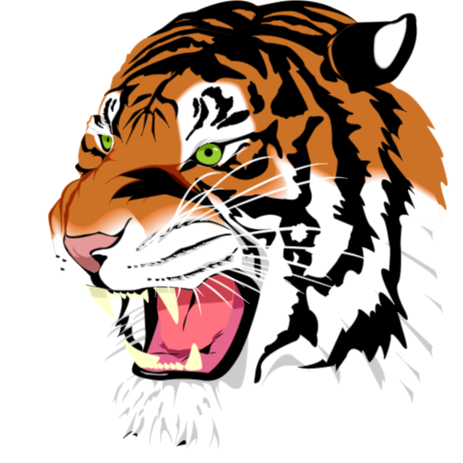
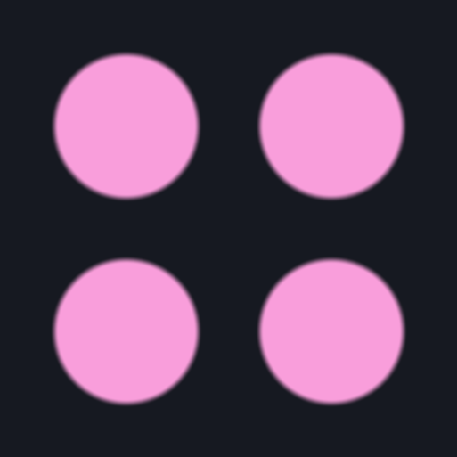
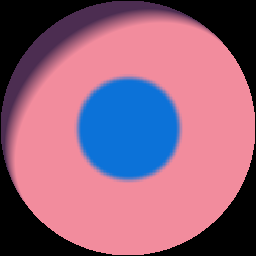

# vsekai-materialx

**PBR + NPR (MToon / SCSS) + vector glyph maps (Slug / Splat) expressed entirely as
*stock* MaterialX nodes** — so MaterialX's own ShaderGen emits GLSL / MSL / OSL / MDL /
**Slang** for all of them, with no custom per-target source. The generated Slang is
**differentiable**, so you can fit a material's appearance to a target image via
[SlangPy](https://shader-slang.org/machine-learning/).

This is the runnable MaterialX + Slang + differentiable companion to the Lean
formalization in [`materialx-shaders-lean`](https://github.com/v-sekai-multiplayer-fabric/materialx-shaders-lean)
(copied here under [`lean/`](lean) as the spec: each node graph is proved equal to
its `Shader.Toon` / `Shader.Vector` reference function).

## Gallery

| ThorVG → Slug (tiger, 240 shapes) | Slug + Splat (instanced) | Toon target → fit |
|:---:|:---:|:---:|
|  |  |  |

ThorVG decomposes `tiger.svg` (arcs→cubics, transforms baked, strokes tessellated) into
240 `Shape`s; each is rendered by Slug's exact signed-distance coverage. Center: a render
made from *only* Slug + Splat. Right: an MToon ramp + Slug emblem fit to a target by
gradient descent (`pixi run invert`).

## Why this works

The key realization (verified, not asserted): every shader we care about reduces to a
composition of **standard** MaterialX nodes.

| Shader | Stock-node realization | Lean reference |
|---|---|---|
| **MToon** ramp | `dot → +shift → linearstep(clamp) → mix` | `Shader.Toon.rampV1` |
| **SCSS** crosstone | `dot → 2×smoothstep → 2×mix` | `Shader.Toon.scss` |
| **Slug** glyph coverage | `image → median(min/max) → smoothstep` (MSDF decode) | `Shader.Vector.decodeMSDF` |
| **Splat** instancing | N×`slug_path((uv−offset)/scale)` folded by a presence-weighted **alpha-over** union | `Shader.Splat.splatEval` |
| **PBR** | stock `gltf_pbr` / `standard_surface` (MaterialX's native domain) | `Shader.MaterialX.convert` |

Because they are pure stock graphs, **MaterialX's Slang ShaderGen (1.39.5+) compiles
them for free** — and a stock graph runs on any conformant MaterialX renderer, so
nothing here is locked to one engine.

## Differentiable

The generated Slang has built-in autodiff, so the whole material is differentiable in
its continuous inputs — MToon `shade/lit/shift/toony`, Slug `smoothing` + atlas texels,
Splat `offset/scale/weight`. **Inverse rendering** (fit those to a target raster) is the
[`invert`](scripts/invert_toon.py) demo.

- **Differentiable instance count.** Splat gives each instance a presence weight
  `wᵢ∈[0,1]` and unions via alpha-over `1−∏(1−wᵢ·covᵢ)`; the count `N=Σwᵢ` is then
  learnable (optimize soft, threshold `wᵢ>0.5` to deploy the hard `max` union). This is
  also the **PSO-style symbol-art** model (layered shapes + per-layer opacity).
- **Neural textures** map onto the same native/fallback split: a feature grid = stock
  `image` nodes; a small decoder MLP = a Slang custom node (cooperative vectors), trained
  with the same SlangPy loop; bake to textures for the portable fallback.

> **Note — "Splat" here is *not* Gaussian Splatting.** It's bounded vector-instance
> splatting (the capability Substance calls "FX-Map", untrademarked name). Different
> representation, different domain; the only overlap is differentiable alpha-compositing.

## Raster → vector

Two routes, pick by content:

- **Calculated (Slug, exact) — the main path, no ML.** Trace a flat region's boundary
  to an outline, then render with Slug's **analytic** signed-distance coverage
  (`Shader.Vector.slugCoverage`). Deterministic, resolution-independent, exact for
  vector-like content (logos, decals, glyphs, stylized/toon maps).
  → [`scripts/raster_to_vector_slug.py`](scripts/raster_to_vector_slug.py)
- **Differentiable fit — fallback for photographs.** A photo has no exact finite-vector
  form, so fit a bounded set of colored splat layers (opacity sparsity ⇒ the layer count
  emerges). → [`scripts/raster_to_vector.py`](scripts/raster_to_vector.py)

Point either at a Sketchfab-exported texture to vectorize its maps into a stock-MaterialX
vector material. (Recreating the glTF *PBR* as MaterialX is the easy half — `gltf_pbr` +
`image` nodes; the vector decomposition is the novel half.)

### ThorVG as the vector front end

Don't reimplement SVG. **[ThorVG](https://github.com/thorvg/thorvg)** already parses
SVG / Lottie / TVG and **decomposes** them — arcs → cubics, transforms baked, strokes
tessellated, gradients resolved — into flat `Shape` paths (`MoveTo/LineTo/CubicTo/Close`).
[`vsekai_materialx/thorvg_decompose.py`](vsekai_materialx/thorvg_decompose.py) binds
ThorVG's C API via `ctypes`, walks the loaded picture with an `Accessor`, and hands those
Béziers straight to Slug. Build the lib once:

```bash
pip install meson
git clone --depth 1 https://github.com/thorvg/thorvg && cd thorvg
meson setup build -Dengines=cpu -Dloaders=svg -Dbindings=capi -Ddefault_library=shared
ninja -C build              # -> build/src/libthorvg-1.dll (.so/.dylib)
export THORVG_LIB=$PWD/build/src/libthorvg-1.dll
```

A pure-Python SVG fallback ([`svg_render.py`](vsekai_materialx/svg_render.py)) renders
fills without ThorVG, but flags what it can't do (gradients/strokes/arcs/transforms) —
which is exactly why reusing ThorVG's decomposition is the right call.

## Quick start (Pixi)

```bash
pixi run gen       # load stdlib + vsekai, generate Slang + GLSL for every node
pixi run pbr       # generate Slang surface shaders for the stock PBR materials
pixi run render    # render layered Slug coverage to a PNG (generated/)
pixi run vectorize # calculated raster -> vector via exact Slug coverage (no ML)
pixi run invert    # (fallback) differentiably fit MToon ramp + Slug emblem to a target

pixi run -e gpu render-gpu   # SlangPy GPU path (needs a graphics device)
pixi run -e gpu invert-gpu   # hardware-autodiff fitting via SlangPy
```

The `gen` / `pbr` / `render` / `invert` tasks run on CPU with stock MaterialX and are the
verified path; the `-e gpu` tasks are the SlangPy hardware/differentiable entrypoints.

## Layout

```
libraries/vsekai/vsekai_shaders.mtlx   the stock-node nodedefs + nodegraphs
materials/pbr.mtlx                      stock PBR materials (+ NPR-driven base_color)
vsekai_materialx/                       python: load_document(), generate(), render/invert
scripts/                                validate_gen, gen_pbr, render, invert (CPU)
lean/                                   the Lean 4 spec (proofs the graphs are correct)
references.bib                          MaterialX, Slang, SlangPy, MToon, SCSS, MSDF, Slug, …
generated/                              emitted .slang/.glsl + rendered PNGs
```

## License

Apache-2.0, matching MaterialX. The `lean/` files are copied from
`materialx-shaders-lean`. No third-party game assets are included.
